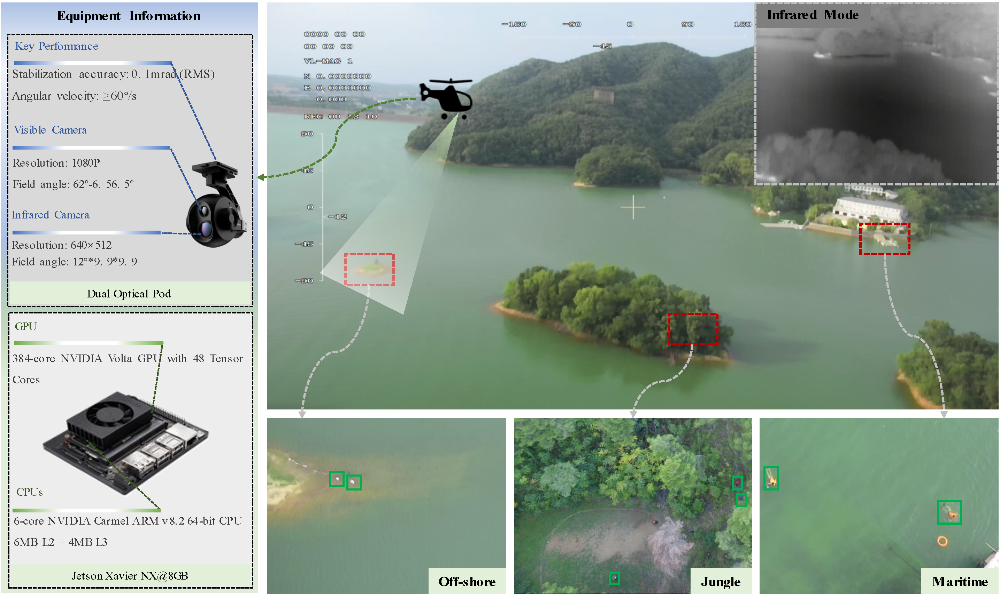
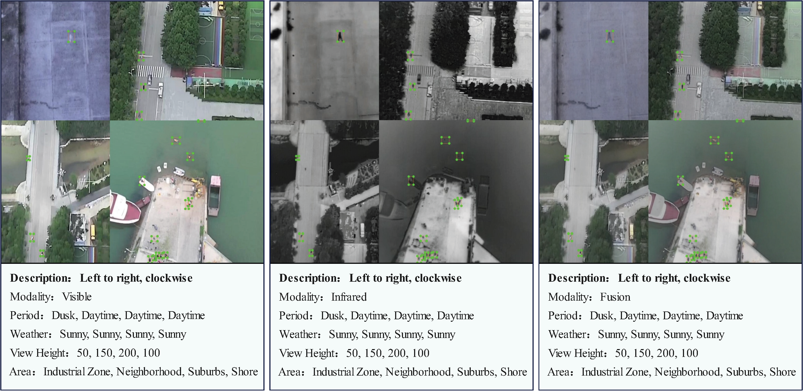

# Aerial Person Detection for Search and Rescue: Survey and Benchmarks

## Collection of VTSaR Dataset

<p align="justify">
We have conducted a comprehensive Aerial Person Detection (APD) dataset labeled as ”VTSaR”, which stands out from the existing publicly accessible APD datasets by offering a greater diversity of scenes, varying personnel behaviors, flexible capture angles, differing capture heights, and an inclusion of aligned visible and infrared samples along with synthetic samples. Our captured system is equipped with a dual-camera gimbal that integrates visible and infrared cameras. This configuration facilitates the simultaneous acquisition of visible and infrared images, providing a diverse corpus of image data gleaned from different perspectives and under varied visibility conditions.  
</p>

  



## Samples of A-VTSaR dataset

<p align="justify">
Obtaining samples from authentic Search and Rescue (SaR) scenarios often proves challenging due to various logistical constraints and statutory regulations. Most samples in our dataset were procured from regions close to personal activity. Nonetheless, limited financial resources frequently hamper the acquisition of samples from flora-dense forests, mountainous terrains, and expansive bodies of water.
</p>


## Samples of AS-VTSaR dataset

<p align="justify">
We adopted an approach to artificially synthesize samples, which incorporating merging numerous visible images via cropping and stitching techniques alongside sourcing high-resolution training samples rendered from cropped regions consistently featuring at least one person. The offline Mosaic approach was applied to infrared images to ensure equivalent sample sizes and consistent crop positioning between visible and infrared images within the same batch. Furthermore, we utilized a simple linear weighting methodology to merge visible and infrared images.
</p>





The dataset can be downloaded from [https://pan.baidu.com/s/12P4tUg03KSYQYlA3E1iD0Q?pwd=zs5z](https://pan.baidu.com/s/1y_kgH4riGIVp7rqTNh6h6A?pwd=qqru), the code is qqru.

## Related Published Paper

```
@article{zhangRobustAerialPerson2024,
  title = {Robust {{Aerial Person Detection With Lightweight Distillation Network}} for {{Edge Deployment}}},
  author = {Zhang, Xiangqing and Feng, Yan and Zhang, Shun and Wang, Nan and Lu, Guohua and Mei, Shaohui},
  year = {2024},
  month = jul,
  journal = {IEEE Transactions on Geoscience and Remote Sensing},
  volume = {62},
  pages = {1--16},
  doi = {10.1109/TGRS.2024.3421310}
}
```
